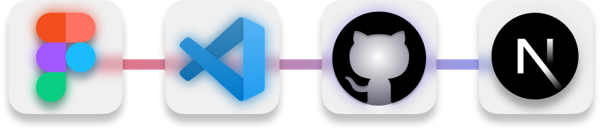

**`Desenvolvedor Front-end`** **`UX/UI Designer`** 

Um estudante do 3° período de  Desenvolvimento de Software Multiplataforma na FATEC Registro e formado como Técnico em Desenvolvimento de Sistemas na ETEC Registro.

Tenho grande afinidade com **desenvolvimento Front-end** e **UX/UI**, buscando sempre unir estética e funcionalidade em cada projeto que desenvolvo.

 

###

____________________________

### 

 

### 

 
 

<!-- Usando tabela para colocar as divs lado a lado -->

  
  

